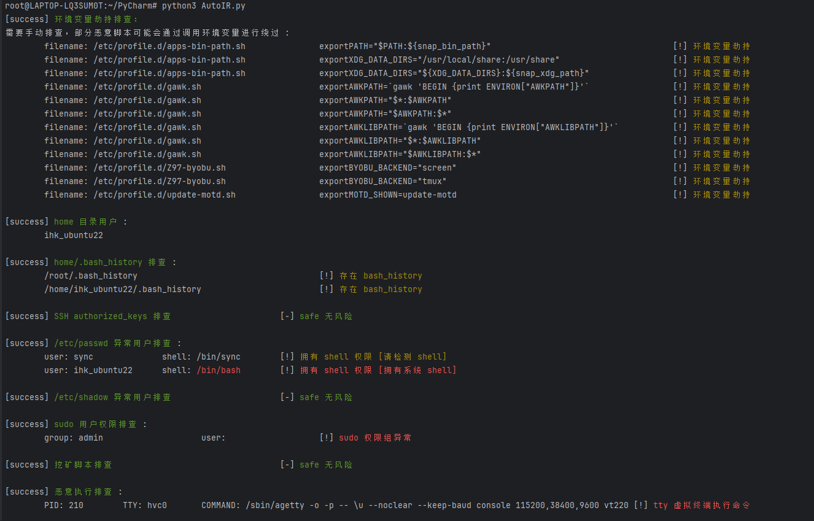
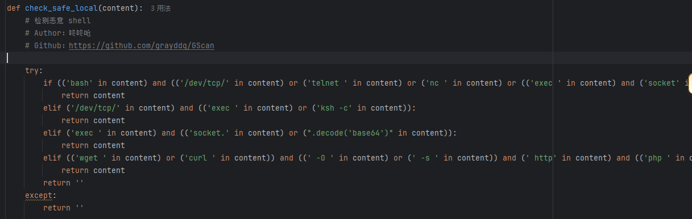

# CTF自动化应急响应工具本地版

```
AutoIR/
  ├── __init__.py  
  │
  ├── AutoIR.py             # 主进程，用于接受传参
  │
  ├── DumpFileInfo.py       # /usr/bin 误判过高时，用于创建新的 bin_info.json 
  │
  ├── core/
  │   ├── __init__.py
  │   ├── core.py           # 核心，调用模块
  │   └── functions.py      # 静态方法
  │
  ├── extensions/
  │   ├── chkrookit         # rookit 检测扩展
  │
  └── plugins/
      ├── __init__.py 
      ├── User_Analysis.py  # 用户检测模块
      ├── ...
      ├── ...
      └── others.py         # 其他检测模块

# 数据格式
{
  'status': False,          # 检测结果 bool
  'result': response        # 执行结果
}
```


## 功能列表

```
# 劫持排查
  1. 排查环境是否被劫持
  
# 恶意用户排查
  1. 排查 home 下用户
  2. 排查 /etc/passwd 下，拥有 shell 权限、root 权限、特殊权限的用户
  3. 排查 /etc/shadow 下，空口令用户（无密码登录用户）
  4. 排查 sudo 中权限异常用户
  5. 排查 拥有 authorized_keys 免密登录用户

# ProcAnalysis 恶意进程排查
  1. 排查 恶意挖矿脚本
  2. 排查 恶意启动，恶意命令执行的进程
  3. 排查 隐藏pid检
  4. 排查 被恶意替换命令名称的进程
  5. 排查 被恶意 mount 挂载的进程

# NetworkAnalysis 网络排查
  1. 分析网络对外连接
  2. 检测存在的网卡
  3. hosts 排查
  
# FileAnalysis 恶意文件检测
  1. /usr/bin 排查
  2. /tmp 排查
  3. × web root webshell 扫描（Local 版本不支持，请查看 AutoIR-Remote 项目）
 
# BackdoorAnalysis 后门排查
  1. LD_PRELOAD后门检测
  2. LD_AOUT_PRELOAD后门检测
  3. LD_ELF_PRELOAD后门检测
  4. LD_LIBRARY_PATH后门检测
  5. ld.so.preload后门检测
  6. PROMPT_COMMAND后门检测
  7. cron后门检测
  8. alias后门
  9. ssh后门 ln -sf /usr/sbin/sshd /tmp/su; /tmp/su -oPort=5555;
  10. SSH Server wrapper 后门，替换/user/sbin/sshd 为脚本文件
  11. /etc/inetd.conf 后门
  12. /etc/xinetd.conf/后门
  13. setuid类后门
  14. /etc/fstab类后门（待写）
  13. 系统启动项后门检测

# LogAnalysis
  1. apache2 日志排查信息统计（并未制作 IIS Nginx Ruoyi 等服务日志审计，一般情况下 应急响应出题使用 Apache 居多）
  2. 登入成功和登入失败信息统计
  
# Rookit 排查
  1. 使用 rkhunter 实现
```


## 运行

直接使用 python 运行即可

```
python AutoIR.py
```

效果图：



## 补充说明

### 1. 恶意命令排查效果差：

建议使用 AutoIR-Remote 版本，排查基于雷池实现，当前代码本地排查部分直接使用了 GScan 的匹配规则，core/functions.py 中注释



推荐赛时进入靶机后进行提权提权，开启 SSH 服务，使用 AutoIR-Remote 版本 调用 雷池 WAF 实现恶意命令排查，匹配更加严格准确

### 2. /usr/bin 排查错误过多

当前代码的 /usr/bin 排查是基于 ubuntu + centos 的 WSL 镜像列出的 json 所以会非常不准确，建议创建一个与靶机相同镜像后，使用 DumpFileInfo.py 存储镜像，并进行替换 plugins 的 FileAnalysis.py

```
'''FileAnalysis.py
# 当 check_bin 误判率过高，使用该脚本
  1. 创建一个应急服务器的基础镜像（手动下载一个全新的镜像）
  2. 开启镜像 SSH 服务
  3. 填入信息后运行该脚本，拔取正确的 /usr/bin 文件信息
'''
```

### 3. 为何使用 Local 版本

Local 版本面向与无 SSH 服务与无法进行提权开启 SSH 服务的靶机，在渗透后只能使用服务器的 Shell 命令，相较于 Remote 版本主要阉割了 雷池WAF 检测 / MCP AI 服务 / Webshell 检测等功能

函数也只保留了几个必要的，避免兼容性问题，排除了如 Json 等模块地使用 直接写入 python 代码的方法（FileAnalysis 模块有超长一大段 json 也是此原因）

```
import os
import re
import urllib
import hashlib
import subprocess
```
### 4. 能否用于 Linux 排查？

此项目只用于 CTF 方向的应急响应排查，切勿用于任何生产环境，功能稀少，仅仅为自用比赛的脚本，如果脚本有 bug 可以联系作者
